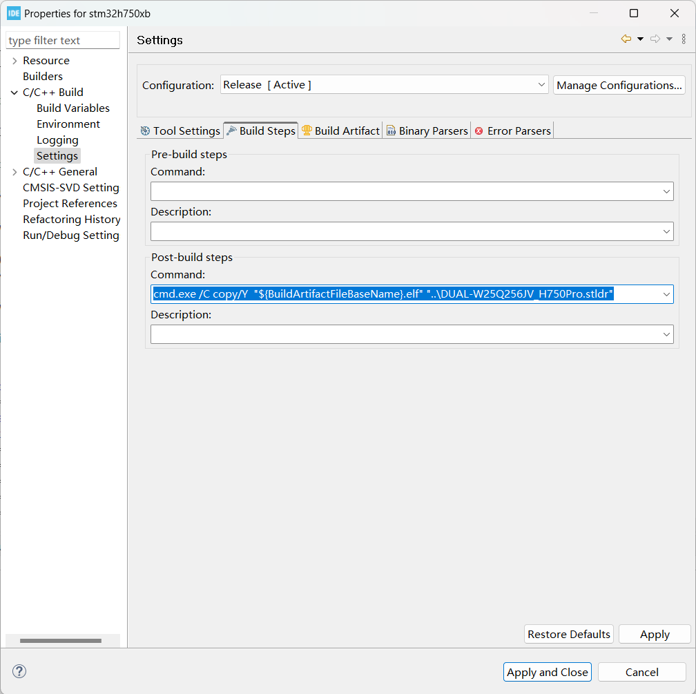

# 下载算法制作

## 1 新建项目

使用STM32CubeMX新建项目，对于FLM下载算法生成一个MDK项目，对于STLDR下载算法生成一个STM32CubeIDE项目。

勾选"Do not generate the main()"。


## 2 链接脚本配置

Keil配置：

```
; Linker Control File (scatter-loading)
;

;Vect 0 
;{
;	Vector 0
;	{
;	* (+RO-DATA)
;	}
;}

PRG 0 PI            ; Programming Functions
{
  PrgCode +0           ; Code
  {
    * (+RO)
  }
  PrgData +0           ; Data
  {
    * (+RW,+ZI)
  }
}

DSCR +0                ; Device Description
{
  DevDscr +0
  {
    FlashDev.o
  }
}
```

CubeIDE配置：

```
/*
*****************************************************************************
**
**  File        : ExternalLoader.ld
**
**  Abstract    : Linker script for STM32H7xx Device with
**                2048KByte FLASH, 128KByte RAM
**
**  Copyright (c) 2020-2021 Clive One / sourcer32@gmail.com
**
*****************************************************************************
*/

/* Entry Point */
ENTRY(Init)

/* Specify the memory areas */
MEMORY
{
  RAM_INFO (r)   : ORIGIN = 0, LENGTH = 1K
  RAM_PROG (xrw) : ORIGIN = 0x24000004, LENGTH = 128K-4 /* 0x20000004 for Non-H7 */
}

/* Define output sections */
SECTIONS
{
  .info :
  {
    KEEP (*(.rodata.StorageInfo))
  } >RAM_INFO

  /* The program code and other data goes into IMAGE */
  .prog :
  {
    . = ALIGN(4);
    *(.text)           /* .text sections (code) */
    *(.text*)          /* .text* sections (code) */
    *(.glue_7)         /* glue arm to thumb code */
    *(.glue_7t)        /* glue thumb to arm code */
    *(.eh_frame)

    /* Ensure entry points are pulled in here */
    KEEP (*(.text.Init))
    KEEP (*(.text.Write))
    KEEP (*(.text.Verify))
    KEEP (*(.text.Checksum))
    KEEP (*(.text.SectorErase))
    KEEP (*(.text.MassErase))

    KEEP (*(.init))
    KEEP (*(.fini))

    . = ALIGN(4);
    _etext = .;        /* define a global symbols at end of code */
  } >RAM_PROG

  /* Constant data goes into IMAGE */
  .rodata :
  {
    . = ALIGN(4);
    *(.rodata)         /* .rodata sections (constants, strings, etc.) */
    *(.rodata*)        /* .rodata* sections (constants, strings, etc.) */
    . = ALIGN(4);
  } >RAM_PROG

  .ARM.extab :
  {
     *(.ARM.extab* .gnu.linkonce.armextab.*)
  } >RAM_PROG

  .ARM :
  {
    __exidx_start = .;
    *(.ARM.exidx*)
    __exidx_end = .;
  } >RAM_PROG

  .preinit_array :
  {
    PROVIDE_HIDDEN (__preinit_array_start = .);
    KEEP (*(.preinit_array*))
    PROVIDE_HIDDEN (__preinit_array_end = .);
  } >RAM_PROG

  .init_array :
  {
    PROVIDE_HIDDEN (__init_array_start = .);
    KEEP (*(SORT(.init_array.*)))
    KEEP (*(.init_array*))
    PROVIDE_HIDDEN (__init_array_end = .);
  } >RAM_PROG

  .fini_array :
  {
    PROVIDE_HIDDEN (__fini_array_start = .);
    KEEP (*(SORT(.fini_array.*)))
    KEEP (*(.fini_array*))
    PROVIDE_HIDDEN (__fini_array_end = .);
  } >RAM_PROG

  /* Initialized data sections goes into RAM, load LMA copy after code */
  .data :
  {
    . = ALIGN(4);
    _sdata = .;        /* create a global symbol at data start */
    *(.data)           /* .data sections */
    *(.data*)          /* .data* sections */

    . = ALIGN(4);
    _edata = .;        /* define a global symbol at data end */
  } >RAM_PROG

  /* Uninitialized data section */
  . = ALIGN(4);
  .bss :
  {
    /* This is used by the startup in order to initialize the .bss secion */
    _sbss = .;         /* define a global symbol at bss start */
    __bss_start__ = _sbss;
    *(.bss)
    *(.bss*)
    *(COMMON)

    . = ALIGN(4);
    _ebss = .;         /* define a global symbol at bss end */
    __bss_end__ = _ebss;
  } >RAM_PROG

  /* Remove information from the standard libraries */
  /DISCARD/ :
  {
    libc.a ( * )
    libm.a ( * )
    libgcc.a ( * )
  }

  .ARM.attributes 0 : { *(.ARM.attributes) }
}
```

## 3 位置无关配置

keil需要配置，stm32cubeide无需（看官方提供的示例是没有配置的），如下图。后续出问题，可以考虑相关配置问题。


## 4 编译后处理配置

Keil添加：

```
cmd.exe /C copy "!L" "..\@L.FLM"
```


STM32CubeIDE添加：

```
cmd.exe /C copy/Y  "${BuildArtifactFileBaseName}.elf" "..\DUAL-W25Q256JV_H750Pro.stldr"
```



## 5 移除启动文件

Keil将启动文件startup_stm32h750xbhx.s移除。


STM32CubeIDE将启动文件startup_stm32h750xbhx.s移除。


## 6 HAL库修改

添加代码替换原本的弱定义函数，替换系统时钟。

```C
HAL_StatusTypeDef HAL_InitTick(uint32_t TickPriority)
{
    return HAL_OK;
}

void HAL_Delay(uint32_t Delay)
{
    volatile int i=0;
    for (i=0; i<0x1000; i++);
}

uint32_t HAL_GetTick(void)
{
    volatile int i;
    for (i=0; i < 512; i++);
    uwTick++;
    return uwTick;
}
```

注释该函数，该函数负责管理QSPI的超时判断，由于系统时钟已经被替换，最好注释该函数，避免超时不准确。


## 7 函数注意点

每个函数最后都进入内存映射模式。


也无需添加读取和校验函数，由于每个函数结尾都进入了内存映射模式，因此会自动读取数据做校验。